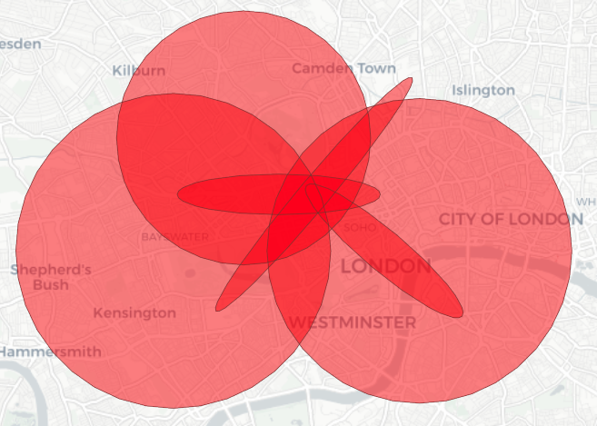
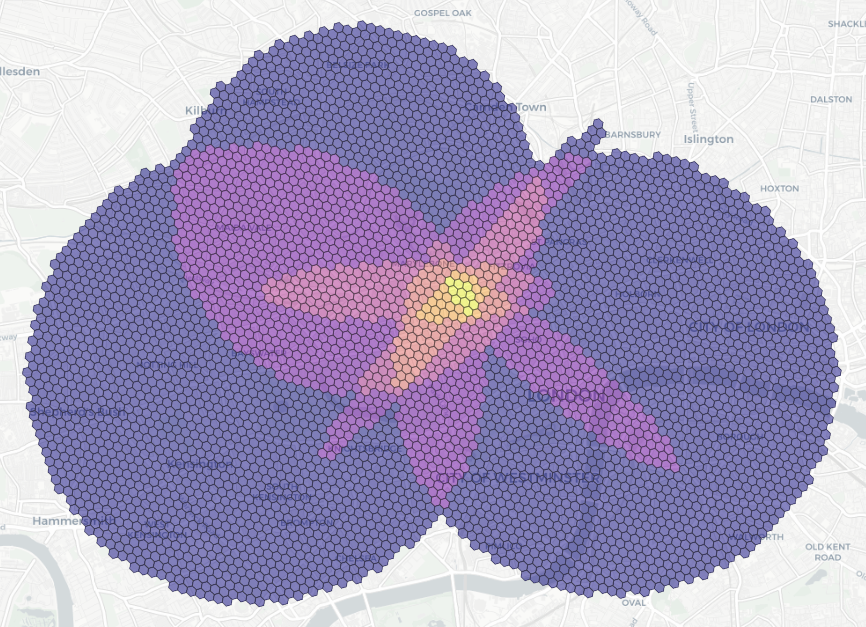

# Geostructures

[](https://github.com/ccbest/geostructures/actions/workflows/unit-tests.yml)

A lightweight implementation of shapes drawn across a geo-temporal plane.




### Installation

Geostructures is available on PYPI
```
$ pip install geostructures
```

#### Optional Dependencies
Geostructures does not require any of the below dependencies to function, however maintains optional features that use:
* geopandas
* H3
* MGRS
* scipy
* shapely

### Overview

Geostructures provides a python interface for functionally defining various shapes drawn on a map. Unlike other libraries such as Shapely, these shapes retain their mathematical definitions rather than being simplified into N-sided polygons.

The shapes currently supported are:
* Boxes
* Circles
* Ellipses
* LineStrings
* Points
* Polygons
* Rings/Wedges

All shapes may optionally be temporally-bound using a specific datetime or a datetime interval.

Additionally, geostructures provides convenience objects for representing chronologically-ordered (`Track`) and unordered (`FeatureCollection`) collections of the above shapes.

## Quick Start

For an interactive introduction, please review our collection of [Jupyter notebooks](./notebooks).

#### Creating GeoShapes
```python
from geostructures import *

box = GeoBox(
    Coordinate(-0.154092, 51.539865),  # Northwest corner
    Coordinate(-0.140592, 51.505665),    # Southeast corner
    properties={"name": "box"}
)

circle = GeoCircle(Coordinate(-0.131092, 51.509865), radius=500, properties={"name": "circle"})

ellipse = GeoEllipse(
    Coordinate(-0.093092, 51.529865), 
    major_axis=1_000, # The distance between the centerpoint and the furthest point along the circumference
    minor_axis=250,   # The distance between the centerpoint and the closest point along the circumference
    rotation=45,       # The angle of rotation (between 0 and 360)
    properties={"name": "ellipse"}
)

ring = GeoRing(
    Coordinate(-0.116092, 51.519865),
    inner_radius=800,
    outer_radius=1000,
    properties={"name": "ring"}
)

wedge = GeoRing(
    Coordinate(-0.101092, 51.514865),
    inner_radius=300,
    outer_radius=500,
    angle_min=60,    # The minimum angle of the wedge
    angle_max=190,   # The maximum angle of the wedge
    properties={"name": "wedge"}
)

linestring = GeoLineString(
    [
        Coordinate(-0.123092, 51.515865), Coordinate(-0.118092, 51.514665), Coordinate(-0.116092, 51.514865),
        Coordinate(-0.116092, 51.518865), Coordinate(-0.108092, 51.512865)
    ],
    properties={"name": "linestring"}
)

point = GeoPoint(Coordinate(-0.116092, 51.519865), properties={"name": "point"})

polygon = GeoPolygon(
    [
        Coordinate(-0.116092, 51.509865), Coordinate(-0.111092, 51.509865), 
        Coordinate(-0.113092, 51.506865), Coordinate(-0.116092, 51.509865)  # Note that the last coordinate is the same as the first
    ],
    properties={"name": "polygon"}
)
```

#### Converting Between Formats
```python
from geostructures import *
from geostructures.collections import FeatureCollection

polygon = GeoPolygon(
    [
        Coordinate(-0.116092, 51.509865), Coordinate(-0.111092, 51.509865), 
        Coordinate(-0.113092, 51.506865), Coordinate(-0.116092, 51.509865)
    ]
)

# Convert to and from a variety of formats
polygon.to_geojson()
polygon.from_geojson( { a geojson object } )

polygon.to_wkt()
polygon.from_wkt( '<a wkt polygon string> ')

polygon.to_shapely()
polygon.from_shapely( a shapely polygon )

# Collections of shapes have additional supported formats
collection = FeatureCollection([polygon])
collection.to_geopandas()
collection.from_geopandas( a geopandas DataFrame )
```

#### Plotting Shapes
```python
from geostructures import *
from geostructures.collections import FeatureCollection
from geostructures.visualization.plotly import draw_collection

box = GeoBox(
    Coordinate(-0.154092, 51.539865),  # Northwest corner
    Coordinate(-0.140592, 51.505665),    # Southeast corner
    properties={"name": "box"}
)
circle = GeoCircle(Coordinate(-0.131092, 51.509865), radius=500, properties={"name": "circle"})
collection = FeatureCollection([box, circle])

# Display the results
draw_collection(collection)
```

#### Bounding Shapes by Time
```python
from datetime import datetime
from geostructures import *
from geostructures.collections import Track
from geostructures.time import TimeInterval

track = Track([
    # Bound shapes to a specific point in time
    GeoPoint(Coordinate(-0.154092, 51.539865), dt=datetime(2020, 5, 1, 12)),
    GeoPoint(Coordinate(-0.155092, 51.540865), dt=datetime(2020, 5, 1, 13)),
    
    # Or bound them to a span of time
    GeoPoint(
        Coordinate(-0.156092, 51.541865), 
        dt=TimeInterval(
            datetime(2020, 5, 1, 14),
            datetime(2020, 5, 1, 15)
        )
    ),
])

# Slice by datetime
subset = track[datetime(2020, 5, 1, 12):datetime(2020, 5, 1, 13)]

# Get efficient metrics between shapes
track.centroid_distances    # meters
track.speed_diffs           # meters per second
track.time_start_diffs      # timedeltas
```

#### Geohashing
```python
from geostructures import *
from geostructures.collections import FeatureCollection
from geostructures.geohash import H3Hasher
from geostructures.visualization.plotly import h3_choropleth

box = GeoBox(
    Coordinate(-0.154092, 51.539865),  # Northwest corner
    Coordinate(-0.140592, 51.505665),    # Southeast corner
    properties={"name": "box"}
)
circle = GeoCircle(Coordinate(-0.131092, 51.509865), radius=500, properties={"name": "circle"})
collection = FeatureCollection([box, circle])

# Create a hasher
hasher = H3Hasher(resolution=10)
hashmap = hasher.hash_collection(collection)

# Display the results
h3_choropleth(hashmap)
```

### Projections

This library assumes that all geospatial terms and structures conform to the 
[WGS84 standard](https://en.wikipedia.org/wiki/World_Geodetic_System).

### Reporting Issues / Requesting Features

The Geostructures team uses Github issues to track development goals. Please include as much detail as possible so we can effectively triage your request.

### Contributing

We welcome all contributors! Please review [CONTRIBUTING.md](./CONTRIBUTING.md) for more information.

### Developers

Carl Best (Sr. Data Scientist/Project Owner)\
https://github.com/ccbest/

Jessica Moore (Sr. Data Scientist)\
https://github.com/jessica-writes-code

