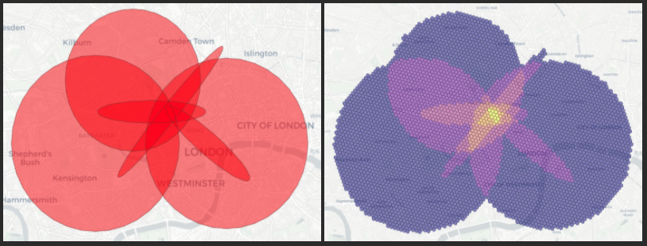

# Geostructures

[](https://github.com/ccbest/geostructures/actions/workflows/unit-tests.yml)

A lightweight implementation of shapes drawn across a geo-temporal plane.

Geostructures makes it easy to:
* Define a variety of common shapes used for geospatial analysis
* Perform common geospatial and geometric calculations
* Convert to/from a variety of geospatial formats
* Temporally bound data by instant or interval
* Convert shapes and coordinates to/from geohashes



### Installation

Geostructures is available on PYPI
```
$ pip install geostructures
```

#### Optional Dependencies
Geostructures does not require any of the below dependencies to function, however maintains optional features that use:
* geopandas
* H3
* MGRS
* scipy
* shapely

### Overview

Geostructures provides a python interface for functionally defining various shapes drawn on a map. Unlike other 
libraries such as Shapely, these shapes retain their mathematical definitions rather than being simplified into N-sided polygons.

The shapes currently supported are:
* Boxes
* Circles
* Ellipses
* LineStrings
* Points
* Polygons
* Rings/Wedges

All shapes may optionally be temporally-bound using a specific datetime or a datetime interval.

Additionally, geostructures provides convenience objects for representing chronologically-ordered (`Track`) and unordered (`FeatureCollection`) collections of the above shapes.

## Quick Start

For an interactive introduction, please review our collection of [Jupyter notebooks](./notebooks).

#### Creating GeoShapes
```python
from geostructures import *

box = GeoBox(
    Coordinate(-0.154092, 51.539865),   # Northwest corner
    Coordinate(-0.140592, 51.505665),   # Southeast corner
)

circle = GeoCircle(
    Coordinate(-0.131092, 51.509865),   # centerpoint
    radius=500, 
)

ellipse = GeoEllipse(
    Coordinate(-0.093092, 51.529865),   # centerpoint
    semi_major=1_000,                   # The distance between the centerpoint and the furthest point along the circumference
    semi_minor=250,                     # The distance between the centerpoint and the closest point along the circumference
    rotation=45,                        # The angle of rotation (between 0 and 360)
)

ring = GeoRing(
    Coordinate(-0.116092, 51.519865),   # centerpoint
    inner_radius=800,
    outer_radius=1000,
    properties={"name": "ring"}
)

# Same as a ring, but with a min/max angle
wedge = GeoRing(
    Coordinate(-0.101092, 51.514865),   # centerpoint
    inner_radius=300,
    outer_radius=500,
    angle_min=60,                       # The minimum angle of the wedge
    angle_max=190,                      # The maximum angle of the wedge
)

linestring = GeoLineString(
    [
        Coordinate(-0.123092, 51.515865), Coordinate(-0.118092, 51.514665), Coordinate(-0.116092, 51.514865),
        Coordinate(-0.116092, 51.518865), Coordinate(-0.108092, 51.512865)
    ],
)

point = GeoPoint(
    Coordinate(-0.116092, 51.519865), 
)

polygon = GeoPolygon(
    [
        Coordinate(-0.116092, 51.509865), Coordinate(-0.111092, 51.509865), 
        Coordinate(-0.113092, 51.506865), Coordinate(-0.116092, 51.509865)  # Note that the last coordinate is the same as the first
    ],
)
```

#### Cutting Holes
Holes are defined using GeoShapes and can be cut from any individual shape (on its own or as a component of a multishape)
```python
from geostructures import *

circle = GeoCircle(
    Coordinate(-0.131092, 51.509865), 
    radius=500, 
    holes=[
        GeoCircle(Coordinate(-0.131092, 51.509865), 250)
    ]
)

```

#### Defining Properties
You can attach whatever properties you want to any shape. Where supported (e.g. GeoJSON and shapefiles), these
properties will remain with the shape when you convert it to a different format.
```python
from geostructures import *

# You can define properties upon instantiation
point = GeoPoint(
    Coordinate(-0.116092, 51.519865), 
    properties={
        'example': 'property'
    }
)

# Or at any time afterwards (will mutate the shape)
point.set_property(
    'example',      # The property key
    2               # The property value
)

```

#### Creating MultiShapes
Multishapes are treated as lists of GeoShapes (of their corresponding type) and can be assigned 
properties/holes/time bounds in the same way.

```python
from geostructures import *

# Multipolygons 
multipolygon = MultiGeoPolygon(
    [
        GeoCircle(Coordinate(-0.131092, 51.509865), 500),
        GeoBox(Coordinate(-0.154092, 51.539865), Coordinate(-0.140592, 51.505665))
    ],
    dt=...,
    properties=...,
)

multipoint = MultiGeoPoint(
    [
        GeoPoint(Coordinate(-0.154092, 51.539865)),
        GeoPoint(Coordinate(-0.140592, 51.505665))
    ],
    dt=...,
    properties=...,
)

multilinestring = MultiGeoLineString(
    [
        GeoLineString([Coordinate(-0.154092, 51.539865), Coordinate(-0.140592, 51.505665), ...]),
        GeoLineString([Coordinate(-0.116092, 51.518865), Coordinate(-0.108092, 51.512865), ...]),
    ],
    dt=...,
    properties=...,
)
```

#### Geometric Operations
Geostructures isn't a replacement for shapely (see conversion to shapely below), however supports 
many geometric operations.

```python
from datetime import datetime
from geostructures import *

circle = GeoCircle(Coordinate(-0.131092, 51.509865), radius=500, dt=datetime(2020, 1, 1))
ellipse = GeoEllipse(Coordinate(-0.093092, 51.529865), semi_major=1_000, semi_minor=250, rotation=45,
                     dt=datetime(2020, 1, 1))

# True/False, do these shapes intersect?
circle.intersects(ellipse)  # Both temporally and spatially
circle.intersects_shape(ellipse)  # Only spatially

# True/False, does the circle fully contain the ellipse?
circle.contains(ellipse)  # Both temporally and spatially
circle.contains_shape(ellipse)  # Only spatially

# Return the rectangle that circumscribes this shape (as a GeoBox)
circle.circumscribing_rectangle()

# Return the circle that circumscribes this shape (as a GeoCircle)
ellipse.circumscribing_circle()

# Get the xmin, xmax, ymin, ymax of this shape
circle.bounds

# Get the area of this shape in meters squared (requires pyproj)
circle.area

# Get the volume of this shape in meters squared seconds (requires pyproj)
circle.volume

# Get the coordinates that define this shapes outer shell
circle.bounding_coords()  # default 36 bounding points
circle.bounding_coords(k=360)  # or define the number of points to increase/decrease precision

# Get a list of all the linear rings that comprise this shape (includes holes)
circle.linear_rings()  # Also accepts k

# Return the convex hull as a GeoPolygon (only for multi-shapes and collections)
multishape = MultiGeoPolygon([circle, ellipse])
multishape.convex_hull()  # Also accepts k
```

#### Converting Between Formats
All objects can be converted to/from most common geospatial formats.
```python
from geostructures import *
from geostructures.collections import FeatureCollection

polygon = GeoPolygon(
    [
        Coordinate(-0.116092, 51.509865), Coordinate(-0.111092, 51.509865), 
        Coordinate(-0.113092, 51.506865), Coordinate(-0.116092, 51.509865)
    ]
)

# GeoJSON
polygon.to_geojson()
polygon.from_geojson( { a geojson object } )

# Well-Known Text (WKT)
polygon.to_wkt()
polygon.from_wkt( '<a wkt polygon string>' )

# Python Shapely
polygon.to_shapely()
polygon.from_shapely( a shapely polygon )

# Collections (and Tracks) of shapes have additional supported formats
collection = FeatureCollection([polygon])

# Creates a geopandas DataFrame
collection.to_geopandas()
collection.from_geopandas( a geopandas DataFrame )

# Creates a GeoJSON FeatureCollection
collection.to_geojson()
collection.from_geojson( { a geojson featurecollection } )

# Read/Write a FeatureCollection to an ESRI Shapefile
from zipfile import ZipFile
with ZipFile('shapefile_name.zip', 'w') as zfile:
    collection.to_shapefile(zfile)

collection.from_shapefile('shapefile_name.zip')

# Shapefiles may contain multiple feature layers, so you can control which ones get read 
collection.from_shapefile('shapefile_name.zip', read_layers=['layer1', 'layer2'])
```

#### Bounding Shapes by Time
All shapes can be bound by time instants or intervals
```python
from datetime import datetime, timedelta
from geostructures import *
from geostructures.time import TimeInterval

# Shapes can be bounded by a datetime to represent an instant in time
point_in_time = GeoPoint(Coordinate(-0.154092, 51.539865), dt=datetime(2020, 5, 1, 12))

# Or they can be bounded by a time interval
span_of_time = GeoPoint(
    Coordinate(-0.155092, 51.540865), 
    dt=TimeInterval(
        datetime(2020, 5, 1, 13),
        datetime(2020, 5, 1, 14)
    )
)

# Time spans can also be set after instantiation
another_point = GeoPoint(Coordinate(-0.154092, 51.539865))
another_point.set_dt(TimeInterval(datetime(2020, 5, 1, 16), datetime(2020, 5, 1, 17)))

# You can buffer a time-bound shape with a timedelta
another_point.buffer_dt(timedelta(hours=6))

# Or strip shape's time bounds
another_point.strip_dt()

# Collections where all underlying shapes are time-bound can be represented as a Track, which
# supports additional features
track = Track([point_in_time, span_of_time])

# Slice by datetime
subset = track[datetime(2020, 5, 1, 12):datetime(2020, 5, 1, 13)]

# Get metrics between shapes
track.centroid_distances    # meters
track.speed_diffs           # meters per second
track.time_start_diffs      # timedeltas
```

#### Geohashing
Geostructures supports geohashing using both Uber's H3 and the original Niemeyer geohashing algorithm.
```python
from geostructures import *
from geostructures.geohash import H3Hasher, NiemeyerHasher, h3_to_geopolygon, niemeyer_to_geobox

box = GeoBox(Coordinate(-0.154092, 51.539865), Coordinate(-0.140592, 51.505665))
circle = GeoCircle(Coordinate(-0.131092, 51.509865), radius=500)
collection = FeatureCollection([box, circle])

# Create a H3 hasher
hasher = H3Hasher(resolution=10)

# Hash a singular shape to return the list of geohashes
set_of_geohashes = hasher.hash_shape(box)

# Convert the geohash into its corresponding GeoShape
geopolygon = h3_to_geopolygon(set_of_geohashes.pop())

# Hash a collection of shapes to return a dictionary of { geohash: [ corresponding geoshapes ] }
# or supply a custom aggregation function
hashmap = hasher.hash_collection(collection)

# Alternatively, hash using the Niemeyer algorithm
hasher = NiemeyerHasher(length=8, base=16)
set_of_geohashes = hasher.hash_shape(box)
geobox = niemeyer_to_geobox(set_of_geohashes.pop(), base=16)
hashmap = hasher.hash_collection(collection)
```

#### Common Geospatial Calculations
```python
from geostructures import Coordinate
from geostructures.calc import *

# The straight-line direction of travel to get from point A to point B
bearing_degrees(Coordinate(-0.154092, 51.539865), Coordinate(-0.140592, 51.505665))

# The great-sphere distance between two points
haversine_distance_meters(Coordinate(-0.154092, 51.539865), Coordinate(-0.140592, 51.505665))

# The resulting coordinate of traveling some distance from point A in a given direction
inverse_haversine_degrees(
    Coordinate(-0.154092, 51.539865),
    45,  # degrees clockwise from true north
    200  # the distance traveled (in meters)
)

# The same, except using radians for direction of travel
inverse_haversine_radians(Coordinate(-0.154092, 51.539865), 0.7853981633974483, 200)

# Rotate coordinates around a defined origin
rotate_coordinates(
    [
        Coordinate(-0.154092, 51.539865), 
        Coordinate(-0.140592, 51.505665)
    ],
    origin=Coordinate(-0.16, 50.24),
    degrees=45,
)

```

### Projections

This library assumes that all geospatial terms and structures conform to the 
[WGS84 standard](https://en.wikipedia.org/wiki/World_Geodetic_System) (CRS 4326).

### Sourcing

This library is designed to implement and extend the requirements of geospatial data laid out by:
* [GML 3.1.1 PIDF-LO Shape Application Schema (PDF Download)](https://portal.ogc.org/files/?artifact_id=21630)
* [RFC5491 (GEOPRIV PIDF-LO Usage)](https://www.rfc-editor.org/rfc/rfc5491.txt)
* [RFC7946 (The GeoJSON Format)](https://datatracker.ietf.org/doc/html/rfc7946)
* [ESRI Shapefile Technical Description - July 1998](http://www.esri.com/library/whitepapers/pdfs/shapefile.pdf)

### Extensions / Related Projects

**[Geochron](https://github.com/etalbert102/geochron)**
A companion package to geostructures enabling geo-spatial-temporal data structures


### Reporting Issues / Requesting Features

The Geostructures team uses Github issues to track development goals. Please be as descriptive 
as possible so we can effectively triage your request.

### Contributing

We welcome all contributors! Please review [CONTRIBUTING.md](./CONTRIBUTING.md) for more information.

### Developers

Carl Best (Sr. Data Scientist/Project Owner)\
https://github.com/ccbest/

Eli Talbert (Sr. Data Scientist/PhD)\
https://github.com/etalbert102

Jessica Moore (Sr. Data Scientist)\
https://github.com/jessica-writes-code

Richard Marshall (Data Scientist/SME)\
https://github.com/RichardMarshall13
